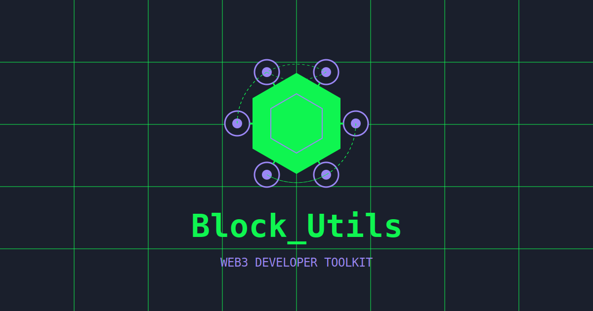

# BlockUtils - Web3 Developer Toolkit

  

## About

BlockUtils is an all-in-one blockchain utility dashboard designed for web3 developers and users. It provides a comprehensive set of tools to interact with blockchains, convert values, manage tokens, and explore networks.

## Features

- **Token Utilities**: Fetch token information, check balances, and interact with tokens
- **Contract Execution**: Execute smart contract functions directly from the UI
- **Hex Converter**: Convert between hexadecimal and other formats
- **ETH Converter**: Convert between different Ethereum units (wei, gwei, eth)
- **Epoch Converter**: Convert between human-readable dates and epoch timestamps
- **Discover Chains**: Explore different blockchain networks and their properties
- **BIP39 Utility**: Generate and manage mnemonic phrases, derive addresses

## Technology

Built with React, TypeScript, and Tailwind CSS. Uses ethers.js for blockchain interactions and various other libraries for cryptographic operations.

## License

MIT License - See LICENSE file for details

